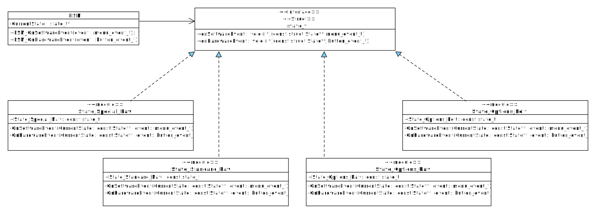
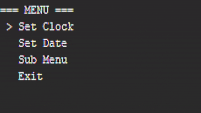

# State Pattern FSM for Menu Navigation

The State Pattern is a behavioral design pattern that allows an object to change its behavior dynamically based on its internal state. Instead of using complex conditional statements, the pattern delegates behavior to state objects where each encapsulates state specific logic.

The overall coordination is performed by the Context, which maintains a reference to the current state and delegates operations to it.

All the State objects implement a common State interface (a struct in case of C implementation), which defines the set of operations that can be performed, regardless of the current state. This also ensures that the Context can interact with states in a uniform way without knowing anything of each state internals.

The following UML diagram illustrates the FSM’s structure:

## Menu Demo:

Visit my [website](https://grecotron.gr/articles/software/fsm/statepattern/) for more info.
